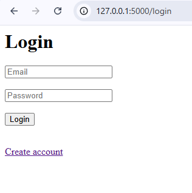
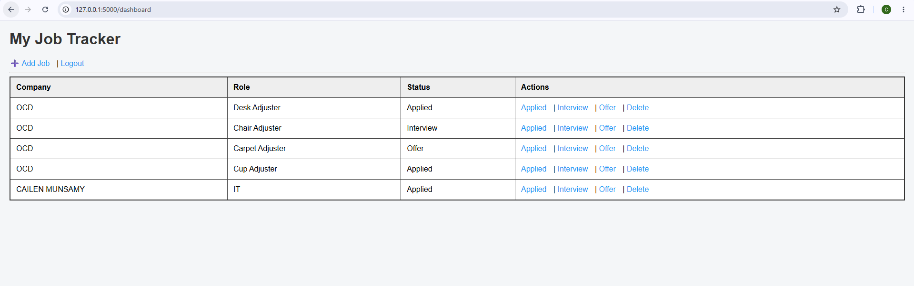
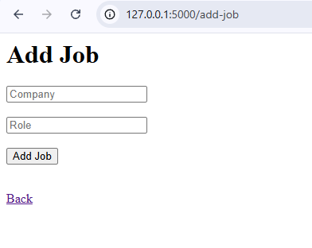

# Smart Job Tracker (Full-Stack Flask App)
## 📌 Overview
Smart Job Tracker is a full-stack web application built with Flask that allows users to register, log in, and manage job applications in one place. It demonstrates authentication, CRUD operations, and database integration.

---

## 📸 Screenshots

### Login Page


### Dashboard


### Add Job Form


---

## 🚀 Features
- User Registration and Login System
- Secure Authentication (Session-based)
- Add, View, and Manage Job Applications
- Dashboard for tracking applications
- SQLite database integration
- Responsive frontend using HTML/CSS

---

## 🛠️ Tech Stack
- Backend: Python (Flask)
- Frontend: HTML, CSS
- Database: SQLite
- Tools: Git, GitHub, VS Code

---

## 📂 Project Structure
- `app.py` → Main Flask application
- `templates/` → HTML pages (login, register, dashboard)
- `static/` → CSS styling
- `instance/` → Database storage

---

## 🎯 Purpose
This project was built to demonstrate full-stack development skills including backend logic, authentication systems, and database handling. It is suitable for junior software engineering and IT graduate roles.

---

## 📸 Demo
The screenshots above demonstrate the application's authentication flow, dashboard interface, and job management functionality.

---

## 🔧 How to Run

```bash
pip install flask
python app.py